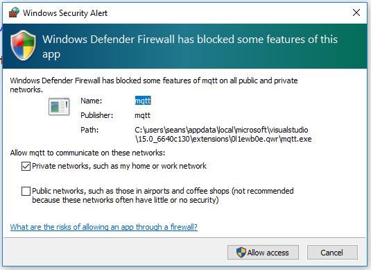
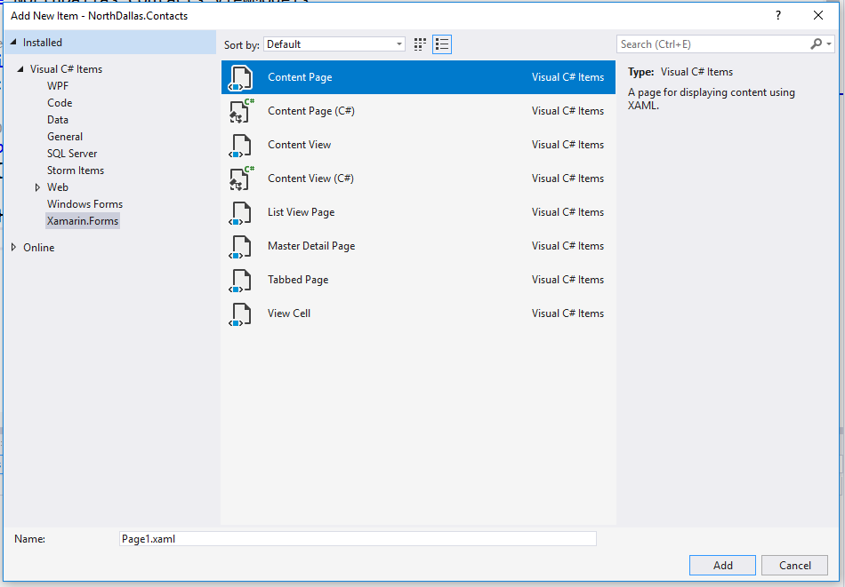
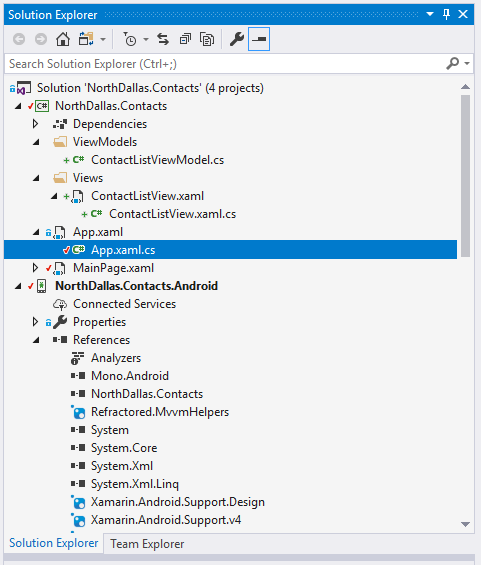

# Introduction to Xamarin.Forms #

Xamarin.Forms is a cross-platform UI toolkit that allows developers to efficiently create native user interface layouts that can be shared across iOS, Android, and Universal Windows Platform apps. This series introduces the basics of Xamarin.Forms development and covers building multi-platform and multi-screen applications.

## Prerequisites ##

### Windows ###
* Installation of Visual Studio 2017 for Windows with Xamarin [[instructions](https://docs.microsoft.com/en-us/xamarin/cross-platform/get-started/installation/windows)]
* Installation of GitHub Desktop Client [[instructions](https://desktop.github.com/)]
  (You can use whatever client you are familiar with.)
* Update Visual Studio 2017 for Windows [[instructions](https://docs.microsoft.com/en-us/visualstudio/install/update-visual-studio?view=vs-2017)]

### macOs ###
* Installation of Visual Studio for Mac [[instructions](https://docs.microsoft.com/en-us/visualstudio/mac/installation)]
* Installation of GitHub Desktop Client [[instructions](https://desktop.github.com/)]
* Update Visual Studio for Mac [[instructions](https://docs.microsoft.com/en-us/visualstudio/mac/update)]

### RandomUser API ###
Documentation:  [[here](https://randomuser.me/documentation)]

## Step 0 - New Project ##
Create new Solution with Xamarin Forms Template

1. Open Visual Studio
2. Open Menu `File > New > Projects`
3. Select Template `Installed > Visual C# > Cross-Platform > Mobile App (Xamarin.Forms)`

4. Enter the name for project your project (i.e. `NorthDallas.Contacts`)
5. Select the settings as shown in the picture and click `Ok`

6. Project will be generated with all the needed files

## Step 1 (Windows Only) - Live Reload ##
Setup LiveReload for rapid iterations through development.

1. Open Menu `Tools > Extensions and Updates`
2. Select `Online` from the left
3. Type `Live Reload` in the search bar

4. Click `Download`
5. You will be prompted to restart Visual Studio.  Do so.
6. Click `Modify` when prompted by Live Reload installer.

7. Reopen Visual Studio after the installation is complete
8. Re-Open your newly created project
9. Right Click `Dependencies` in your Xamarin.Forms Project `NorthDallas.Contacts`
10. Click `Manage NuGet Packages`
11.  Click the `Browse` Tab
12.  Select `LiveReload` for the `Package source`

13. Install the `Xamarin.LiveReload` package
14. Add `LiveReload.Init();` to the class App in the Xamarin.Forms Project `NorthDallas.Contacts`
```C#
public partial class App : Application
{
    public App ()
    {
        // Initialize Live Reload.
        #if DEBUG
        LiveReload.Init();
        #endif
        
        InitializeComponent();
        MainPage = new MainPage();
    }
}
```
15. Open `NorthDallas.Contacts\MainPage.xaml` page
16. Click the `Connect` link in the yellow bar above your XAML page 

17. Open your firewall for the Live Reload connection


### Step 2 - Run your Application ###
1. Select `NorthDallas.Contacts.Android` from your start project selector
2. Select your emulator and press run

3. If you are using Live Reload, you may make changes to the `NorthDallas.Contacts\MainPage.xaml` page and save the file to see the changes.

### Step 3 - Change your Label ###
1. With your `MainPage.xaml` page open, change the label to say "Welcome to Dallas!" from "Welcome to Xamarin.Forms!"
2. If you are running LiveReload, it should just update in the emulator.  Otherwise you have to run the app again.

### Step 4 - Create a View Model ###
We'll be using Model-View-ViewModel for Xamarin.Forms.  There are a lot of advantages to them.  The first thing we'll need to do is create a ViewModel.

1. Stop the application from running.
2. In the `NorthDallas.Contacts` Solution, right click the project and select `Manage NuGet Packages for Solution` from the context menu.
3. Select `nuget.org` as your `Package Source`
4. Click on the `Browse` tab
5. Type the following into the search `Refractored.MvvmHelpers`
6. In the right pane, select all the projects and click `Install`
2. In the `NorthDallas.Contacts` project, right click the project and choose `Add > New Folder`.
3. Name as `ViewModels`
4. Now right click that folder and select `Add > Class`
5. Enter the name `ContactListViewModel.cs` and click `Add`
6. Make `ContactListViewModel` implement `INotifyPropertyChanged` using `MvvmHelpers`
```C#
    public class ContactListViewModel
        : BaseViewModel
    {
        public ContactListViewModel()
        {
            Title = "Welcome to the Contact List";
        }
    }
```

### Step 5 - Create a View ###
Views is another piece of the MVVM architecture.  This is what the user interacts with, the UI.

1. Create another folder inside of `NorthDallas.Contacts` named `Views`.
2. Right click the new folder `Views` and choose `Add > New Item` from the context menu.
3. Select the template `Xamarin.Forms > Content Page` and enter the name `ContactListView.xaml` and click `Add`.

4. Point the application to start with `ContactListView.xaml`
5. Open `NorthDallas.Contacts\App.xaml.cs` file from under the `App.xaml` file.

6. Assign a new instance of `ContactListView` to the `MainPage` property by replacing the existing assignment.
```C#
MainPage = new ContactListView();
```
7. You can delete `NorthDallas.Contacts\MainPage.xaml` file now.
8. Run the application and see that it now starts with the new view.

### Step 6 - Add a ListView ###
Most of Mobile development is displaying lists of data.  Let's add a `ListView` to `ContactListView` page.

1. Create a new property to store contacts in `ContactListViewModel.cs`.
```C#
public ObservableRangeCollection<string> Contacts { get; set; } =
    new ObservableRangeCollection<string>();
```
2. Add fake data to the `ContactListViewModel` to render on the view by placing the following code in your constructor.
```C#
Contacts.AddRange(new string[]
{
    "Sean",
    "Homero",
    "Gabrielle",
    "Anna",
    "Annette",
    "Bella",
    "Brett",
    "Stephen"
});
```
3. Replace the `Label` in the `NorthDallas.Contacts\Views\ContactListView.xaml` with a `ListView`.
```XML
<ListView ItemsSource="{Binding Contacts}"
		  RowHeight="70">
    <ListView.ItemTemplate>
        <DataTemplate>
            <TextCell Text="{Binding .}" />
        </DataTemplate>
    </ListView.ItemTemplate>
</ListView>
```

### Step 7 - Bind View to ViewModel
1. Open `NorthDallas.Contacts\View\ContactListView.xaml.cs` from under the `ContactListView.xaml` file.
2. Add the `ContactListViewModel` as the `BindingContext` in the constructor `ContactListView` class.
```C#
	public ContactListView ()
	{
	    BindingContext = new ContactListViewModel();
		InitializeComponent ();
	}
```
3. Run the Application and see the list of people.

### Step 8 - Create a RandomUser Client ###
For this workshop, we will be using RandomUser API [[documentation](https://randomuser.me/documentation)].  We will be using [JSON 2 CSharp](http://json2csharp.com/) to generate POCO (Plain Old CSharp Object).

1. Take a results example from the documentation page and paste it into the JSON 2 CSharp page.
2. Click the `Generate` button.
3. Click the `Copy` button at the bottom of the page, select the code, and copy the text to get the generated code.
4. Create a new folder `Models` in the `NorthDallas.Contacts` project.
5. Create new a class in the `Models` folder by right clicking the folder and choosing `Add > Class...`.
6. Name the class `RandomUserResults.cs`.
7. Replace the class in the new file with the copied code from JSON 2 CSharp.
8. In the `NorthDallas.Contacts` Solution, right click the project and select `Manage NuGet Packages for Solution` from the context menu.
9. Select `nuget.org` as your `Package Source`
10. Click on the `Browse` tab
11. Type the following into the search `Newtonsoft.Json`
12. In the right pane, select all the projects and click `Install`
13. Create a new folder `Services` in the `NorthDallas.Contacts` project.
14. Create new a class in the `Services` folder by right clicking the folder and choosing `Add > Class...`.
15. Name the new class `UserService.cs`.
16. Replace the new class with the following.
```C#
public class UserService
{
    public async Task<List<Result>> GetUsersAsync(int count)
    {
        var httpClient = new HttpClient();

        var response = await httpClient.GetAsync($"https://randomuser.me/api/?results={count}&seed=northdallas");

        if (response.IsSuccessStatusCode)
        {
            var json = await response.Content.ReadAsStringAsync();

            var results = JsonConvert.DeserializeObject<RootObject>(json);

            return results.results;
        }

        throw new Exception("API call failed!");
    }
}
```

### Step 9 - Use The New Client ###
Now that you have created a client to pull user data from RandomUser.me, you need to use the data.

1. Open `NorthDallas.Contacts\ViewModels\ContactListViewModel.cs` and add a new parameter to the `ContactListViewModel` constructor.
```C#
public ContactListViewModel(UserService userService)
```
2. Create a new class variable inside of the `ContactListViewModel`.
```C#
private UserService _userService;
```
3. Assign the constructor parameter to the class variable inside the constructor and remove the `AddRange` from the constructor.
```C#
public ContactListViewModel(UserService userService)
{
    _userService = userService;
}
```
5. Update the `Contacts` property to the type of `ObservableRangeCollection<Result>`.
```C#
public ObservableRangeCollection<Result> Contacts { get; set; } =
	new ObservableRangeCollection<Result>();
``` 
5. Create a new method inside of `NorthDallas.Contacts\ViewModels\ContactListViewModel.cs` and name it `ExecuteRefreshCommandAsync`.
```C#
private async Task ExecuteRefreshCommandAsync()
{
    try
    {
        IsBusy = true;
        Contacts.Clear();
        Contacts.AddRange(await _userService.GetUsersAsync(100));
    }
    catch(Exception ex)
    {
        Debug.WriteLine(ex);
    }
    finally
    {
        IsBusy = false;
    }
}
```
6. Add a new command.  We will use the `RefreshCommand` to pull down random users from the API.
```C#
private ICommand _refreshCommand;
public ICommand RefreshCommand =>
    _refreshCommand ?? (_refreshCommand = new Command(async () => await ExecuteRefreshCommandAsync()));
```
7. Open the `NorthDallas.Contacts\Views\ContactListView.xaml.cs` file from under the `ContactListView.xaml` file.
8. Create a new class variable to store the view model.
```C#
private ContactListViewModel _viewModel;
```
9. Assign the new `ContactListViewModel` to the `_viewModel` inside of the constructor of `ContactListView`.
```C#
BindingContext = _viewModel = new ContactListViewModel(new UserService());
```
10. Now we want to pull the data on when the page is first being put on the screen.
```C#
protected override void OnAppearing()
{
    base.OnAppearing();

    _viewModel.RefreshCommand.Execute(null);
}
```
11. Now run the application.  You will find the cells blank.
12. Fix this by updating your `TextCell` to bind to name.
```XML
<TextCell Text="{Binding name.first}" Detail="{Binding name.last}" />
```
13. Run the application again.

### Step 10 - Create a Custom View Cell
While a list of names is great, you will want to display more than one or two pieces of data or even an email.  You need a custom cell for this.

1. You need to replace the `TextCell` with a `ViewCell`
2. Your content for the template will be inside the `ViewCell`
3. Replace your `TextCell` with the following.
```XML
	<ViewCell>
	    <StackLayout>
	        <Label FontAttributes="Bold">
	            <Label.FormattedText>
	                <FormattedString>
	                    <Span Text="{Binding name.last}" />
	                    <Span Text=", " />
	                    <Span Text="{Binding name.first}" />
	                </FormattedString>
	            </Label.FormattedText>
	        </Label>
	        <Label>
	            <Label.FormattedText>
	                <FormattedString>
	                    <Span Text="{Binding location.city}" />
	                    <Span Text=", " />
	                    <Span Text="{Binding location.state}" />
	                </FormattedString>
	            </Label.FormattedText>
	        </Label>
	    </StackLayout>
	</ViewCell>
```

### Step 11 - Add an Image to the Custom View Cell
1. To add an image, you will need to include another NuGet package.
2. Click on the `Browse` tab
3. Type the following into the search `Xamarin.FFImageLoading.Forms`
4. In the right pane, select all the projects and click `Install`
5. In the `NorthDallas.Contacts` Solution, right click the project and select `Manage NuGet Packages for Solution` from the context menu.
6. In the right pane, select the iOS, Android and UWP projects and click `Install`
7. Click on the `Updates` tab
8. Check the box for `Xamarin.Forms`
9. Click the `Update` button in the left pane
10. Accept the EULA
11. Open the `NorthDallas.Contacts.Android\MainActivity.cs` file and add the following to the beginning of the `OnCreate` method.
```C#
Xamarin.Forms.Forms.SetFlags("FastRenderers_Experimental");
FFImageLoading.Forms.Platform.CachedImageRenderer.Init(true);
```
12. Open the `NorthDallas.Contacts.iOS\AppDelegate.cs` file and add the following the beginning of the `FinishedLaunching` method.
```C#
FFImageLoading.Forms.Platform.CachedImageRenderer.Init();
```
13. Go back to the `ContactListView.xaml` file and add the following to `ContentPage` node.
```
	xmlns:ffimage="clr-namespace:FFImageLoading.Forms;assembly=FFImageLoading.Forms"
```
14. Now you can add a caching image to your custom view cell.
15. Update your `ViewCell` with the following.
```XML
<Grid>
    <Grid.RowDefinitions>
        <RowDefinition Height="50" />
        <RowDefinition Height="50" />
    </Grid.RowDefinitions>
    <Grid.ColumnDefinitions>
        <ColumnDefinition Width="50" />
        <ColumnDefinition Width="*" />
    </Grid.ColumnDefinitions>

    <ffimage:CachedImage Grid.Row="0"
                         Grid.Column="0"
                         WidthRequest="300"
                         HeightRequest="300"
                         Source="{Binding picture.large}"/>

    <StackLayout Grid.Row="0"
                 Grid.Column="1">
        <Label FontAttributes="Bold">
            <Label.FormattedText>
                <FormattedString>
                    <Span Text="{Binding name.last}" />
                    <Span Text=", " />
                    <Span Text="{Binding name.first}" />
                </FormattedString>
            </Label.FormattedText>
        </Label>
        <Label>
            <Label.FormattedText>
                <FormattedString>
                    <Span Text="{Binding location.city}" />
                    <Span Text=", " />
                    <Span Text="{Binding location.state}" />
                </FormattedString>
            </Label.FormattedText>
        </Label>
    </StackLayout>
</Grid>
```

### Step 12 - Add Loading Placeholder ###
As you scroll through the ListView, you will notice that some of the images look like a previous image until it has a chance to finish loading.  To fix this, you wil need to add a `LoadingPlaceHolder` tag.

1. Add the `LoadingPlaceholder` tag to the `CachedImage`node.
```
LoadingPlaceholder="http://placekitten.com/300/300"
``` 
2. Run the application.

### Step 13 - Add a Transformation to Your Image ###
To keep up with trends, mobile applications have be updated regularly.  One of the latest trends is circular images.  It is easy to add a circular transformation with Fast & Furious Image Loading.

1. In the `NorthDallas.Contacts` Solution, right click the project and select `Manage NuGet Packages for Solution` from the context menu.
2. Click on the `Browse` tab
3. Type the following into the search `Xamarin.FFImageLoading.Transformations`
4. In the right pane, select all the projects and click `Install`
6. In the `NorthDallas.Contacts` Solution, right click the project and select `Manage NuGet Packages for Solution` from the context menu.
7. Go back to the `ContactListView.xaml` file and add the following reference to `ContentPage` node.
```
xmlns:tranformations="clr-namespace:FFImageLoading.Transformations;assembly=FFImageLoading.Transformations"
```
8. Add a `CircleTransformation` to the `CachedImage`.
```XML
<ffimage:CachedImage Grid.Row="0"
                     Grid.Column="0"
                     WidthRequest="300"
                     HeightRequest="300"
                     Source="{Binding picture.thumbnail}"
                     LoadingPlaceholder="http://placekitten.com/300/300">
    <ffimage:CachedImage.Transformations>
        <tranformations:CircleTransformation />
    </ffimage:CachedImage.Transformations>
</ffimage:CachedImage>
```

### Step 14 - Create Detail View Model ###
This is the first step towards creating a detail page.  Once we have a detail page, we will enable the user to navigate to the detail by selecting an item in the `ListView`.

1. Now right click that folder and select `Add > Class`
2. Enter the name `ContactDetailViewModel.cs` and click `Add`
6. Make `ContactDetailViewModel` implement `INotifyPropertyChanged` using `MvvmHelpers`
```C#
public class ContactDetailViewModel
    : BaseViewModel
{
    public ContactDetailViewModel(Result contact)
    {
        Contact = contact;
        Title = $"{contact.name.first} {contact.name.last}";
    }

    public Result Contact { get; set; }
}
```

### Step 15 - Create the Detail View ###
We need to create a view to display the details of the contact.

1. Right click the folder `Views` and choose `Add > New Item` from the context menu.
2. Select the template `Xamarin.Forms > Content Page` and enter the name `ContactDetailView.xaml` and click `Add`.

3. Replace the XAML for `ContactDetailView.xaml`
```XML
<?xml version="1.0" encoding="utf-8" ?>
<ContentPage xmlns="http://xamarin.com/schemas/2014/forms"
             xmlns:x="http://schemas.microsoft.com/winfx/2009/xaml"
             xmlns:ffimage="clr-namespace:FFImageLoading.Forms;assembly=FFImageLoading.Forms"
             xmlns:tranformations="clr-namespace:FFImageLoading.Transformations;assembly=FFImageLoading.Transformations"
             x:Class="NorthDallas.Contacts.Views.ContactDetailView"
             Title="{Binding Title}">
    <ContentPage.Content>
        <ScrollView>
            <Grid>
                <Grid.RowDefinitions>
                    <RowDefinition Height="300" />
                    <RowDefinition Height="*" />
                </Grid.RowDefinitions>
                <ffimage:CachedImage Grid.Row="0"
                                     VerticalOptions="FillAndExpand"
                                     HorizontalOptions="FillAndExpand"
                                     Source="{Binding Contact.picture.large}"
                                     LoadingPlaceholder="http://placekitten.com/300/300"
                                     Margin="50, 0, 50, 0">
                    <ffimage:CachedImage.Transformations>
                        <tranformations:CircleTransformation />
                    </ffimage:CachedImage.Transformations>
                </ffimage:CachedImage>
                <StackLayout Grid.Row="1" Margin="10, 0, 10, 0">
                    <Label FontSize="Micro">Name:</Label>
                    <Label FontAttributes="Bold"
                           FontSize="Large">
                        <Label.FormattedText>
                            <FormattedString>
                                <Span Text="{Binding Contact.name.last}" />
                                <Span Text=", " />
                                <Span Text="{Binding Contact.name.first}" />
                            </FormattedString>
                        </Label.FormattedText>
                    </Label>
                    <Label FontSize="Micro">Location:</Label>
                    <Label FontAttributes="Bold"
                           FontSize="Large">
                        <Label.FormattedText>
                            <FormattedString>
                                <Span Text="{Binding Contact.location.city}" />
                                <Span Text=", " />
                                <Span Text="{Binding Contact.location.state}" />
                            </FormattedString>
                        </Label.FormattedText>
                    </Label>
                    <Label FontSize="Micro">Email:</Label>
                    <Label FontAttributes="Bold"
                           FontSize="Large"
                           Text="{Binding Contact.email}"/>
                    <Label FontSize="Micro">Phone:</Label>
                    <Label FontAttributes="Bold"
                           FontSize="Large"
                           Text="{Binding Contact.phone}"/>
                    <Label FontSize="Micro">Cell:</Label>
                    <Label FontAttributes="Bold"
                           FontSize="Large"
                           Text="{Binding Contact.cell}"/>
                </StackLayout>
            </Grid>
        </ScrollView>
    </ContentPage.Content>
</ContentPage>
```
4. Add a constructor parameter for `ContactDetailView` in `NorthDallas.Contacts\Views\ContactDetailView.xaml.cs`
```C#
public ContactDetailView (ContactDetailViewModel viewModel)
{
    BindingContext = viewModel;
	InitializeComponent ();
}
```

### Step 16 - Add the OnSelectedItem Event to the ListView ###
Now it's time to wire everything up.

1. Open the `ContactListView.xaml` file.
2. Add `ItemSelected="OnContactSelected"` to the `ListView` node inside of the file.
3. Open the `ContactListView.xaml.cs` file under the `ContactListView.xaml` page.
4. Add a new method to the class to handle the `ItemSelected` event.
```C#
private void OnContactSelected(object sender, SelectedItemChangedEventArgs e)
{
    if (e.SelectedItem is Result)
    {
        Navigation.PushAsync(new ContactDetailView(new ContactDetailViewModel((Result)e.SelectedItem)));
        var listView = (ListView)sender;
        listView.SelectedItem = null;
    }
}
```
5. Open the `App.xaml.cs` file under the `App.xaml` inside of your project.
6. Wrap the `MainPage` with a new instance of `NavigationPage`.
```C#
MainPage = new NavigationPage(new ContactListView());
``` 
